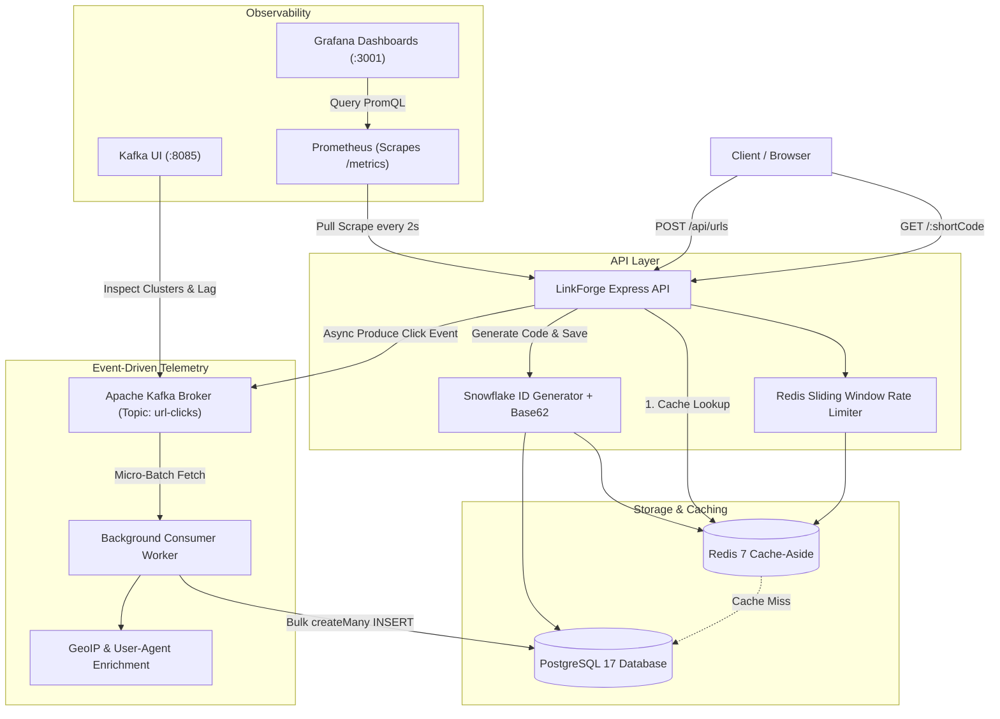

# LinkForge ⚡

> **High-throughput, distributed URL shortener & real-time click telemetry engine engineered for low-latency scale.**

LinkForge is built with **Node.js, Express, TypeScript, Redis, Apache Kafka, and PostgreSQL**. Designed from the ground up to solve the core architectural challenges of read-heavy distributed URL shortening: **sub-millisecond redirects**, **cache stampede prevention**, **conflict-free distributed ID generation**, and **asynchronous event-driven analytics**.

---

## 🚀 Key Highlights & Benchmarked Scale

* ⚡ **Sub-2ms Redirect Latency**: Achieved **`1.65ms` median (`p50`)** and **`6.61ms` `p95`** redirect latency over 21,500+ requests under 400 concurrent virtual users.
* 📦 **1,550+ Writes/Second**: Sustained **1,558 URL creation transactions/sec** (over 93,500 links generated in 60s) with a `p95` of **`74ms`**.
* 🆔 **Zero Collision Distributed IDs**: Custom 64-bit Snowflake-style ID generator paired with Base62 encoding guaranteeing collision-free unique keys without centralized database auto-increment bottlenecks.
* 🛡️ **Mathematical Rate Limiting**: Distributed sliding-window rate limiter powered by Redis, actively rejecting burst traffic with sub-millisecond `HTTP 429 Too Many Requests`.
* 📨 **Decoupled Telemetry via Kafka**: Click events are asynchronously emitted to Kafka with zero blocking on redirects. Background workers consume in micro-batches (`minBytes: 16KB`) for high-speed bulk ingestion into PostgreSQL.
* 📊 **End-to-End Observability**: Built-in metrics export via `prom-client`, pre-configured **Prometheus**, automated **Grafana** dashboards, and **Kafka UI**.

---

## 🏛️ System Architecture



---

## 📊 Empirical Benchmarks (Tested via k6)

Empirically verified on Apple Silicon under simulated high-concurrency production load:

| Scenario | Target Endpoint | Concurrency | Throughput | Median (`p50`) | 95th Percentile (`p95`) | Error Rate | Data Layer |
| :--- | :--- | :--- | :--- | :--- | :--- | :--- | :--- |
| **Hot Link Redirects** | `GET /:shortCode` | 400 VUs | **357.5 RPS** | **1.65 ms** | **6.61 ms** | **0.00%** | In-Memory (Redis) |
| **Cold Link Reads** | `GET /:randomCode` | 150 VUs | **2,877.5 RPS** | **20.37 ms** | **58.17 ms** | 0.00%* | Disk B-Tree (Postgres) |
| **URL Creation** | `POST /api/urls` | 250 VUs | **1,558.7 writes/s** | **21.89 ms** | **74.07 ms** | **0.00%** | Snowflake + PG + Redis |

> ⚡ **Performance Delta**: Redis Cache-Aside delivers a **12.3x lower latency** compared to disk-based PostgreSQL B-Tree queries (`1.65ms` vs `20.37ms`).

---

## 🛠️ Tech Stack

* **Backend**: Node.js, Express, TypeScript, Prisma ORM, `tsx`
* **Caching & Rate Limiting**: Redis 7 Alpine, `ioredis`, `rate-limit-redis`
* **Database**: PostgreSQL 17
* **Event Streaming**: Apache Kafka 3.7.0 (KRaft mode), `kafkajs`
* **Observability**: Prometheus, Grafana, `prom-client`, `provectuslabs/kafka-ui`
* **Load Testing**: Grafana k6

---

## 🖥️ Local Infrastructure & Dashboards

All backing services run via Docker Compose:

| Service | Address | Description | Credentials |
| :--- | :--- | :--- | :--- |
| **Express API** | `http://localhost:3000` | Core REST API & Redirects | — |
| **Frontend App** | `http://localhost:5173` | React + Vite UI | — |
| **Grafana** | `http://localhost:3001` | Real-time RPS, Latency, Cache Hit Dashboards | `admin` / `admin` |
| **Prometheus** | `http://localhost:9090` | Raw Metrics & Targets status | — |
| **Kafka UI** | `http://localhost:8085` | Topic inspector, message stream, consumer lag | — |

---

## 🏁 Quickstart

### 1. Clone & Start Infrastructure
```bash
git clone https://github.com/your-username/LinkForge.git
cd LinkForge

# Start Postgres, Redis, Kafka, Prometheus, Grafana, and Kafka UI
docker compose up -d
```

### 2. Setup Environment Variables
```bash
cp api/.env.example api/.env
```
Ensure your database and Redis connection strings match `docker-compose.yaml`.

### 3. Install & Start Backend Services
```bash
# Terminal 1: API
cd api
npm install
npx prisma db push
npm run dev

# Terminal 2: Analytics Worker
cd ../worker
npm install
npm run dev
```

### 4. Run Load Testing Benchmarks
```bash
# Benchmark hot cache redirects
k6 run results/load-test.js

# Benchmark concurrent URL creations
k6 run results/write-load-test.js

# Benchmark cold cache misses
k6 run results/random-code-load-test.js
```

---

## 📄 License
MIT © LinkForge
